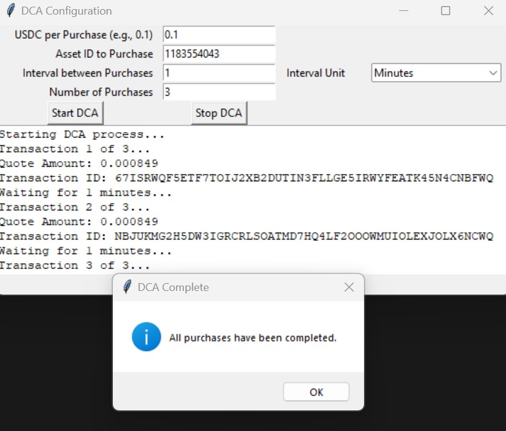

# Algorand DCA Machine
 This script automates DCA purchases for crypto assets using USDC on the Folks Finance platform. Uses Unofficial Python SDK by algolog https://github.com/algolog/ff-py-sdk

## Screenshot

## Features
- Securely stores wallet mnemonic
- Customizable purchase intervals
- Intuitive GUI

## Requirements
- Python 3.9+
- Install dependencies: `pip install -r requirements.txt`

## Usage
1. Create a `.env` file and set `WALLET_MNEMONIC`. The script will prompt you for it and create the file if you try to run without.
2. Run the script: `python dca_machine.py`.

## Considerations
1. User a wallet dedicated to this purpose, and only fund it with what you intend to use. 
2. Ensure that you have opted into the assets that you are using.
3. Ensure you have enough ALGO in the wallet to pay transaction fees.

## License
MIT License.
